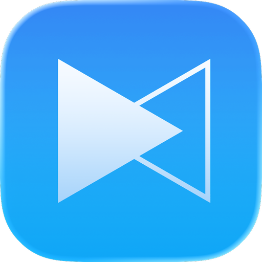

# Cogitator

### One-liner
Constant thinking machine on your mac device, it see you see, say you want to say, faster than faster. 

Mac App Store (coming soon)

https://github.com/user-attachments/assets/6b06956a-75c1-4ace-9fd3-b8eecd5f654c

https://github.com/user-attachments/assets/024003c1-c463-44de-8d8e-d5ce02720fe5

https://github.com/user-attachments/assets/74d13314-295e-4697-8cbb-784430becc2e

### Why it matters
Manual prompting wastes time. Cogitator auto-collects context, anticipates needs, and keeps you focused on the actual task.

### Tech highlights
- OCR-first capture to turn visuals into text, slashing latency and compute vs. raw images.
- Embedding-backed day-long memory for semantic recall of what you saw or did earlier.
- Low-latency XAI pipeline tuned for sub-3s end-to-end responses.

### Architecture (thin slice)
- Capture: `ScreenRecorderService`, `OCRService` → fast text from screen frames.
- Memory: `EmbeddingService` → indexes daily activity for retrieval.
- LLM flow: `LLMPipelineService`, `XAIService` → prompt + generation with latency targets.
- UI: SwiftUI views (`DevCaptureView`, `ProductCaptureView`) orchestrated by `CogitatorApp` and `CaptureViewModel`.

### What’s next
Push accuracy and proactivity: richer context modeling, smarter retrieval, tighter latency budgets.
